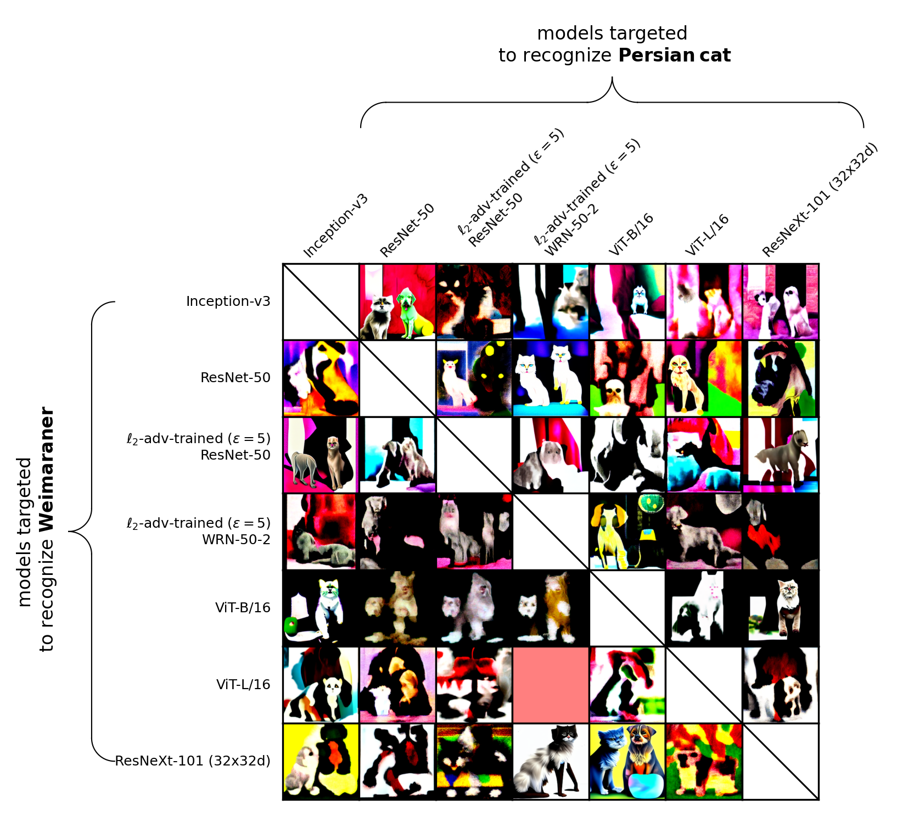
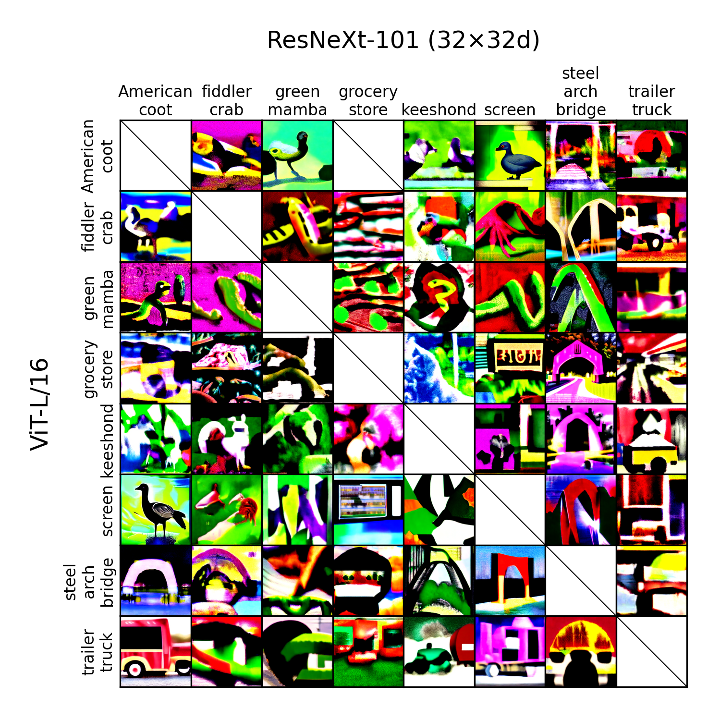

# Controversial Stimuli Tutorial

This repository contains code and experiments for generating controversial stimuli using diffusion models, aimed at studying differences between deep learning models.

## Project Overview

Controversial stimuli are images that cause different computer vision models to produce different classification results for the same image. This project implements various methods for generating such stimuli, with a special focus on techniques using diffusion models as image generators.

### Key Features

- Generate controversial stimuli using various methods:
  - Direct optimization
  - Diffusion pixel-space optimization
  - Diffusion latent-space optimization
  - Diffusion noise-space optimization
  - Unconditional diffusion model optimization
- Support for multiple pretrained vision models:
  - ResNet50
  - InceptionV3
  - Adversarially trained ResNet models
  - ViT-B/16 and ViT-L/16 models
  - ResNeXt101_32x32d
- Visualization of controversial stimuli matrices

## Installation

```bash
# Clone the repository
git clone https://github.com/chenghands-on/controversial_stimuli_tutorial.git
cd controversial_stimuli_tutorial

# Create conda environment
conda create -n contro_stim_env python=3.11
conda activate contro_stim_env

# Install dependencies
pip install torch torchvision
pip install diffusers transformers
pip install colored matplotlib seaborn pandas attrdict
pip install timm  # For loading ResNeXt and ViT models
```

## Usage

### Generating Controversial Stimuli

Use the `batch_optimize.py` script to generate controversial stimuli:

```bash
# Using direct optimization method
python batch_optimize.py --experiments cat_vs_dog --optimization_methods direct --max_steps 300 --min_controversiality 0.8

# Using diffusion latent space optimization
python batch_optimize.py --experiments cat_vs_dog --optimization_methods diffusion_latent --max_steps 300 --min_controversiality 0.8

# Using unconditional diffusion noise space optimization
python batch_optimize.py --experiments cat_vs_dog --optimization_methods diffusion_noise_unconditional --max_steps 300 --min_controversiality 0.8
```

### Visualizing Results

Use the `plot_cat_vs_dog.py` script to create matrices of controversial stimuli:

```bash
# Visualize images generated with diffusion models
python plot_cat_vs_dog.py --stimuli_path optimization_results/diffusion_noise_optim_cat_vs_dog_v3 --figpath figures

# Visualize images generated with unconditional diffusion models
python plot_cat_vs_dog.py --stimuli_path optimization_results/diffusion_noise_unconditional_optim_cat_vs_dog_v3 --figpath figures
```

## File Structure

- `optimize_functions.py`: Implementation of various optimization methods
- `models.py`: Definition and loading of different pretrained models
- `batch_optimize.py`: Script for batch generation of controversial stimuli
- `plot_cat_vs_dog.py`: Script for visualizing generated results
- `optimization_results/`: Storage for generated images
- `figures/`: Storage for visualization results

## Example Images

Below are some example images of controversial stimuli generated by our methods:

### Cat vs. Dog Experiment

This image shows results from our cat vs. dog experiment using diffusion noise optimization method. The visualization displays how different models classify the same synthetic images differently:



### Model Comparison: ViTL16 vs. ResNeXt101

This example shows controversial stimuli optimized specifically to highlight differences between ViT-L/16 and ResNeXt101 models:



## Citation

If you use this code, please cite the original paper:

```
@article{golan2020controversial,
  title={Controversial stimuli: Pitting neural networks against each other as models of human recognition},
  author={Golan, Tal and Raju, Prashant C and Kriegeskorte, Nikolaus},
  journal={Proceedings of the National Academy of Sciences},
  volume={117},
  number={47},
  pages={29330--29337},
  year={2020},
  publisher={National Academy of Sciences}
}
```

## License

MIT
